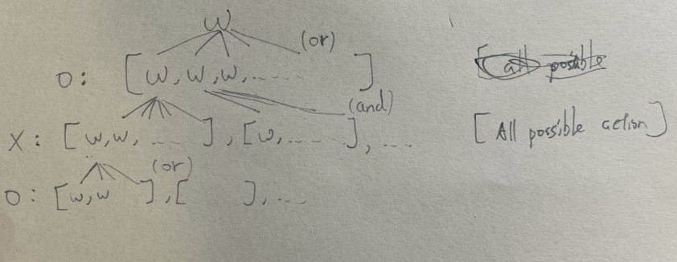
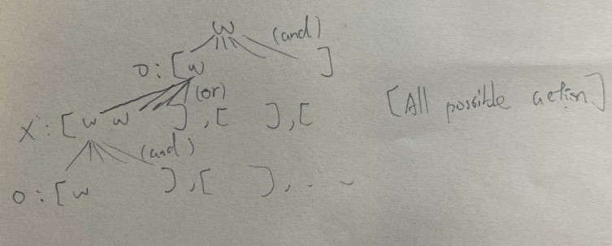

## Goal
Proof that no one can win the game if each player choose the right action choice.

To prove this, we must first show that the first player must win, then prove that the second player must win. If both assumptions are not true, then we can prove "No one can win" or "Always a tie".

## Proof
### First, proof stater must win



- $\text{Denote } w \text{ as O must win (boolean)}$
- $w = w(\text{game\_status})$, where "$\text{game\_status}$" represents the current state of the game.

- During "O" turns, if the current game status allows "O" to make a move that would lead to an "O" victory, we can conclude that $w$ is true.

- During "X" turns, if the current game status, regardless of where "X" plays, would result in an "O" victory, we can also conclude that $w$ is true.

- In the figure, we want to verify the root $w$.
    - First, during "O" turns, if any of the child nodes (available moves for "O") has $w$ set to true, then the root $w$ is true.
    - To verify these child nodes with $w$ set to true, secondly, during "X" turns, if all of the child nodes (available moves for "X") have $w$ set to true, then the parent node $w$ is true.

### Second, proof second player must win

- $\text{Denote } w \text{ as X must win (boolean)}$
- $w = w(\text{game\_status})$, where "$\text{game\_status}$" represents the current state of the game.

- During "O" turns, if the current game status, regardless of where "O" plays, would result in an "X" victory, we can also conclude that $w$ is true.

- During "X" turns, if the current game status allows "X" to make a move that would lead to an "X" victory, we can conclude that $w$ is true.


## Program
Python script: `tictactoe.py`, run:

```shell
$ python tictactoe.py
```

## Version2
If you're having difficulty understanding the program, feel free to switch over to the `version2` branch for a potentially easier version.

## Chess board module
In `chessboard.py`, the `Board` class has several methods that can be used, such as examining the game's history and creating a Tic Tac Toe game to play, and more.
